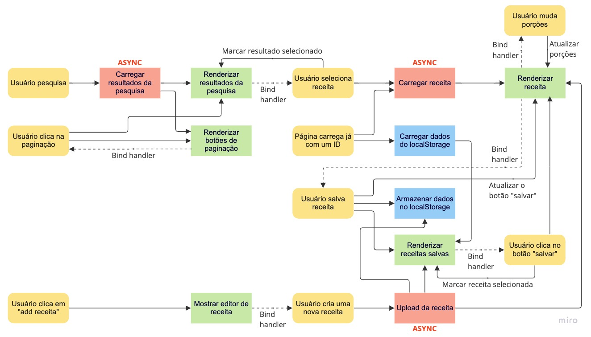
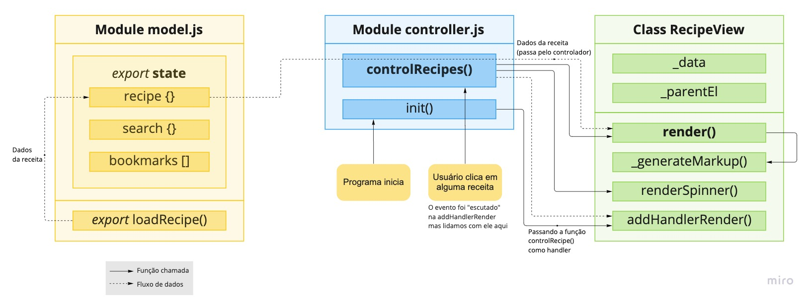

# Forkify App

Este é o projeto final de um curso de JavaScript. A aplicação foi criada do absoluto zero, usando todos os conhecimentos, técnicas e guidelines adquiridos ao longo do curso.

## Objetivo

Criar uma aplicação onde o usuário pudesse pesquisar receitas, visualizá-las, ajustar as receitas para preparar o número de porções desejado, salvar receitas para visualizar posteriormente e também adicionar novas receitas.

## Como rodar

O resultado final do projeto está [hospedado aqui](https://forkify-migliori.netlify.app/).

Para testar, basta acessar. =)

## Como esse projeto foi feito?

A aplicação foi criada com as linguagens básicas do desenvolvimento web (HTML, CSS e JS) e consome uma API de receitas chamada [Forkify](https://forkify-api.herokuapp.com/v2). Esse foi um dos projetos que mais gostei de construir até o momento, então detalhei melhor todo o processo a seguir!

### Planejamento 1/4: User stories

Nessa primeira parte, pra começar a entender como a aplicação seria e o que ela deveria fazer, usei a técnica de **user stories**. Ela consiste, basicamente, em colocar-se na posição de usuário e descrever o app sob a perspectiva dele. Por exemplo:

> Como um usuário, quero pesquisar receitas para encontrar novas ideias de pratos.
>
> Como um usuário, quero escolher o número de porções para poder preparar meus pratos para diferentes números de pessoas.
>
> Como um usuário, quero criar minhas próprias receitas, para mantê-las organizadas no mesmo app.
>
> Como um usuário, quero guardar receitas para poder revisitá-las depois.

### Planejamento 2/4: Features

Com base nas histórias dos usuários, o próximo passo foi transformá-las em features que a aplicação deveria ter:

> #### Pesquisar receitas
>
> - Um input que envia requests para a API com as palavras-chave inseridas
> - Apresentar os resultados da request, com paginação (se necessário)
> - Visualização da receita com o tempo de preparo, porções e ingredientes

> #### Escolher porções
>
> - Atualizar as quantidades de ingredientes de acordo com o número de porções selecionado

> #### Criar receitas
>
> - Campo para o usuário enviar a sua receita
> - Guardar as receitas enviadas automaticamente
> - O usuário pode ver suas próprias receitas, mas outros usuários não podem

> #### Guardar receitas
>
> - Opção de marcar/desmarcar receitas
> - Apresentar uma lista com as receitas marcadas pelo usuário
> - Armazenar as receitas no navegador usando localStorage
> - Quando a página do app for carregada, ler os dados do localStorage e renderizá-los

### Planejamento 3/4: Fluxograma

Com as features em mente, o próximo passo foi estruturá-las de maneira coerente. Para isso, criei um fluxograma do app para me guiar. Vale ressaltar que, ao longo do desenvolvimento do app, o fluxograma foi ajustado e melhorado até chegar nessa versão completa:

### Planejamento 4/4: Arquitetura

Essa, sem dúvidas, foi uma das partes mais desafiadoras, porém sei que foi também uma das mais engrandecedoras. Aqui, depois de estudar um pouco sobre arquitetura de software, segui o padrão MVC conforme apresentado no curso. Para exemplificar, esse é um diagrama da implementação que foi feita na parte que mostra as receitas:

### Desenvolvimento 1/?: Primeiras requests e views

Comecei o projeto pela parte principal: buscar uma receita na API. Nesse primeiro momento, usei a função _fetch()_ com o endpoint + um ID retirado da documentação, direto no código mesmo.

Com a request e a conversão do arquivo JSON para um objeto dando certo, eu tinha uma receita exemplo pra começar a trabalhar na renderização desse objeto no DOM.

Por fim, simulei uma busca real fazendo a aplicação escutar os eventos de _load_ e _hashchange_ para diferentes IDs de receita e só então fazer o fetch com o ID retirado do DOM.

### Desenvolvimento 2/?: Refatorando para MVC

Todo o código, até aqui, estava em um único arquivo. Comecei a refatorar o código pra respeitar a arquitetura MVC, da forma que foi representado no diagrama do planejamento.

O arquivo que estava trabalhando passou a ser o _model.js_, e criei o arquivo _controller.js_ para ser o controlador e o arquivo _recipeView.js_ para ser a view responsável pela renderização das receitas. Em seguida, reorganizei todo o código feito até o momento da seguinte forma:

#### model.js

Esse módulo passou a ser o responsável por toda a interação com a API e pelas regras de negócio. É composto pela variável _state_ e funções que a manipulam. Tanto _state_ quanto as funções do _model.js_ são exportadas pra que o controlador possa acessá-las.

#### recipeView.js

Esse módulo foi a primeira view da aplicação. É a _class RecipeView {...}_, que contém as variáveis e métodos necessários para manipular o DOM e pegar informações dele, quando preciso. Exportar a própria classe permitiria que ela fosse manipulada e possiblitaria erros e bugs. Então, em vez disso, esse módulo exporta uma nova instância de _RecipeView_.

#### controller.js

De forma resumida, é a ponte entre o _model_ e as _views_.

Esse módulo passou a ser o responsável pela lógica da aplicação em si (não pelas regras de negócio), e controla tanto _model.js_ quanto as _views_. É basicamente o "decision maker" da aplicação. Ele importa todo o _model.js_ e também uma instância de cada _view_ (por enquanto só de _RecipeView_).

Ele inicia a aplicação, lida com os eventos escutados pelas _views_ invocando os métodos de _model.js_. Também usa o objeto _state_ (de _model.js_) e seus atributos para invocar métodos das _views_ pra que o DOM seja manipulado de acordo.

### Desenvolvimento 3/?: Aplicando o padrão Publisher-Subscriber

Pra manter a estrutura adequada, a parte de escutar os eventos precisava ficar na _recipeView_, enquanto quem de fato lidaria com esses eventos seriam as funções do _controller_, que invocariam os devidos métodos de _model.js_.

Porém, as funções que deveriam ser chamadas pelos eventos escutados pela _recipeView_ estavam em _controller.js_, e não na _recipeView_. Como a _recipeView_ poderiam chamar uma função que, para a _recipeView_, não estava definida?

Para isso, implementamos o padrão **Publisher-Subscriber**. O **Publisher**, nesse caso, é o método _recipeView.addHandlerRender(handler)_. Esse método é chamado pela função _init()_ do _controller_ e passa a função _controlRecipes_ como argumento, fazendo dela o **Subscriber**.

O que acontece ao inicializar o app então é:

1. _init()_ chama _recipeView.addHandlerRender(controlRecipes)_
2. _recipeView.addHandlerRender()_ escuta os eventos de _load_ e _hashchange_ e chama a função _controlRecipes()_ quando ocorrem
3. _controlRecipes()_ pega o ID presente na URL e chama _model.loadRecipe(id)_
4. _model.loadRecipe()_ faz a requisição pra API e atribui o objeto que recebe dela a _model.state.recipe_
5. _controlRecipes()_ chama _recipeView.render(model.state.recipe)_
6. _recipeView.render()_ renderiza o objeto recebido no DOM

### Desenvolvimento 4/?: config.js e helpers.js

Um detalhe legal no meio do processo foi a criação desses 2 arquivos pra literalmente configurar e auxiliar o processo de desenvolvimento.

O _config.js_ exporta variáveis fundamentais que são usadas por muitos (ou todos) componentes da aplicação, como a URL da API, por exemplo.

O _helpers.js_ exporta funções que, da mesma forma, são comuns a vários componentes da aplicação.

### Desenvolvimento 5/?: Implementando recurso de pesquisa

Seguindo o mesmo esquema da _recipeView.js_, criei _searchView.js_ e _resultsView.js_. Responsáveis pelas _views_ da barra de pesquisa e da barra lateral onde os resultados da pesquisa devem ser mostrados, respectivamente.

A partir daqui, podemos pesquisar palavras-chave e visualizar todos os resultados na barra à esquerda. Como a renderização das receitas já estava feita, também é possível selecionar qualquer resultado da lista para visualizá-lo.

### Desenvolvimento 6/?: Melhorando a cadeia de protótipos (herança entre classes)

Nesse ponto, já existiam 3 _views_ que tinham métodos e atributos comuns entre si. Então, extraí esses elementos das _views_ e criei _View.js_ pra ser a parent class delas.

Agora, _RecipeView_, _SearchView_ e _ResultsView_ extendiam _View_. Os métodos e atributos comuns a todas as _views_ passaram a ser herdados de sua parent class, e cada _view_ manteve suas especificidades, evitando código duplicado.
